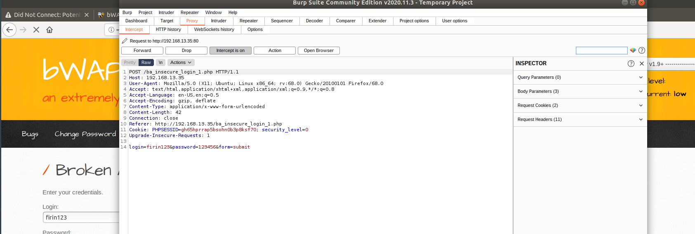

## Web-Vulnerabilities-and-Hardening

### Web Application 1: Your Wish is My Command Injection

I continued my journey towards enhancing my technical acuity through a deeper understanding of web vulnerabilities and system hardening used to help protect and defend critical web infrastructure.
in order to An deep understanding of the underlying mechanics behind how web attacks are constructed from both a conceptual and practical standpoint.
I Access my Vagrant and open a browser.
Navigate to the following webpage: http://192.168.13.25 and I select the Command Injection option.
This page is a new web application built by Replicants in order to enable their customers to ping an IP address. 
The web page will return the results of the ping command back to the user.
Behind the scenes, when you select Submit, the IP you type in the field is injected into a command that is run against the Replicants webserver. 
The specific command that ran on the webserver is ping <IP> and 8.8.8.8 is the field value that is injected into that command.
This process is no different than if we went to the command line and typed that same command.
Now that you have determined that Replicants new application is vulnerable to command injection, you are tasked with using the dot-dot-slash method to design two payloads that will display the contents of the following files:

### **/etc/passwd**

### **/etc/hosts**

**Command Injection Prevention**

- Avoid system calls and user input—to prevent threat actors from inserting characters into the OS command. 
- Set up input validation—to prevent attacks like XSS and SQL Injection.
- Create a white list—of possible inputs, to ensure the system accepts only pre-approved inputs.

Reference page for my mitigation strategies.

https://www.imperva.com/learn/application-security/command-injection/

### Web Application 2: A Brute Force to Be Reckoned With

I Open a browser on Vagrant and navigate to the webpage http://192.168.13.35/
This page is an administrative web application that serves as a simple login page. An administrator enters their username and password and selects Login.

    - If the user/password combination is correct, it will return a successful message.
    - If the user/password combination is incorrect, it will return the message, "Invalid credentials.

    
   

  
   

  
   

I Use the web application tool Burp Suite, specifically the Burp Suite Intruder feature, to determine if any of the administrator accounts are vulnerable to a brute force attack on this web application.
You've been provided with a list of administrators and the breached passwords:

    - List of Administrators

    - Breached list of Passwords

    
**Blocking Brute Force Attacks**

The most obvious way to block brute-force attacks is to simply lock out accounts after a defined number of incorrect password attempts. Account lockouts can last a specific duration, such as one hour, or the accounts could remain locked until manually unlocked by an administrator.

Reference page for my mitigation strategies.

https://owasp.org/www-community/controls/Blocking_Brute_Force_Attacks

### Web Application 3: Where's the BeEF?

On Vagrant, I open my command line and run the following command: sudo beef
This will kick off the BeEF application and return many details about the application to my terminal.
Along with these details are several URLs that can be used to access to BeEF's User Interface (UI). For example: UI_URL: http://127.0.0.1:3000/ui/panel.
The Browser Exploitation Framework (BeEF) is a practical client-side attack tool that exploits vulnerabilities of web browsers to assess the security posture of a target.
An attacker takes a small snippet of code, called a BeEF Hook, and determines a way to add this code into a target website. This is commonly done by cross-site scripting.
When subsequent users access the infected website, the users' browsers become hooked.
Once a browser is hooked, it is referred to as a zombie. A zombie is an infected browser that awaits instructions from the BeEF control panel.
The BeEF control panel has hundreds of exploits that can be launch against the hooked victims, including:

    - Social engineering attacks
    - Stealing confidential data from the victim's machine
    - Accessing system and network information from the victim's machine

To access this simulated infected website, i open the website, which has been infected with a BeEF hook.
this will list folders of hundreds of exploits that can be ran against the hooked browser. First, i attempt a social engineering phishing exploit to create a fake Google login pop up. Were i can use this to capture user credentials like user name and password. the victim could easily mistake this for a real login prompt.
i was able to hook into Replicants website, attempt a couple BeEF exploits. Some that work well include:

    - Social Engineering >> Pretty Theft

    - Social Engineering >> Fake Notification Bar

    - Host >> Get Geolocation (Third Party)

 

  
  
  
  
  

 

  

 

### Outlining mitigation strategies agains this kind of attacks

Keep your system up to date, but that is obvious and wouldn't help you with the IE 0-day last month.

The majority of browser based exploits require JavaScript in some capacity. NoScript helps mitigate these attacks.

The Google Safe browsing API is used by Firefox and Chrome by default to prevent you from reaching a site that is known to be leveraging browser based attacks. However this does nothing for a targeted BeEF attack.

Some Anti-Viruses will plug into your browser and prevent an exploit from loading. This could prevent a targeted BeEF attack. But AV's aren't perfect and can be fooled.

Plan on failure, consider doing most of your day to day browsing inside a VM. Restore this VM to a virgin state on a regular basis (once a week, or once a month). Assume that you have been compromised and change your passwords regularly.

Reference page for my mitigation strategies.

https://security.stackexchange.com/questions/22828/what-are-methods-for-preventing-browser-hooking-drive-by-downloads